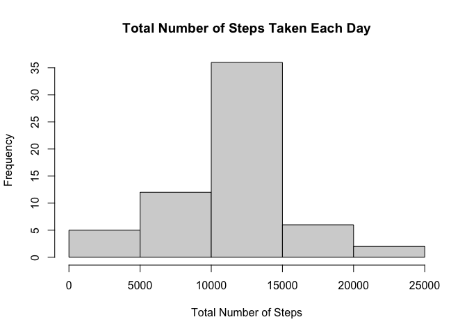

## Loading and preprocessing the data


```r
library(dplyr)
```

```
## Warning: package 'dplyr' was built under R version 4.0.2
```

```
## 
## Attaching package: 'dplyr'
```

```
## The following objects are masked from 'package:stats':
## 
##     filter, lag
```

```
## The following objects are masked from 'package:base':
## 
##     intersect, setdiff, setequal, union
```

```r
data <- read.csv("activity.csv")
data <- tbl_df(data)
```

```
## Warning: `tbl_df()` is deprecated as of dplyr 1.0.0.
## Please use `tibble::as_tibble()` instead.
## This warning is displayed once every 8 hours.
## Call `lifecycle::last_warnings()` to see where this warning was generated.
```

```r
data$date <- as.Date(data$date, "%Y-%m-%d")
```

## What is mean total number of steps taken per day?

1. Calculate the total number of steps taken per day

```r
stepday <- data %>% group_by(date) %>% summarize(sum = sum(steps))
```

```
## `summarise()` ungrouping output (override with `.groups` argument)
```

```r
stepdaywithoutna <- stepday[complete.cases(stepday),]
```
2. Make a histogram of the total number of steps taken each day

```r
hist(stepdaywithoutna$sum, main = "Total Number of Steps Taken Each Day", xlab = "Total Number of Steps")
```

<!-- -->
3. Calculate and report the mean and median of the total number of steps taken per day

```r
mean(stepdaywithoutna$sum)
```

```
## [1] 10766.19
```

```r
median(stepdaywithoutna$sum)
```

```
## [1] 10765
```

## What is the average daily activity pattern?

1. Make a time series plot

```r
stepavg <- data %>% group_by(interval) %>% summarize(mean = mean(steps, na.rm = TRUE))
```

```
## `summarise()` ungrouping output (override with `.groups` argument)
```

```r
plot(stepavg$interval, stepavg$mean, data = stepavg, type = "l", main = "Average Number of Steps Taken", xlab = "Intervals", ylab = "Average Steps")
```

```
## Warning in plot.window(...): "data" is not a graphical parameter
```

```
## Warning in plot.xy(xy, type, ...): "data" is not a graphical parameter
```

```
## Warning in axis(side = side, at = at, labels = labels, ...): "data" is not a
## graphical parameter

## Warning in axis(side = side, at = at, labels = labels, ...): "data" is not a
## graphical parameter
```

```
## Warning in box(...): "data" is not a graphical parameter
```

```
## Warning in title(...): "data" is not a graphical parameter
```

<!-- -->
2. Which 5-minute interval, on average across all the days in the dataset, contains the maximum number of steps?

```r
stepavg %>% filter(mean == max(stepavg$mean))
```

```
## # A tibble: 1 x 2
##   interval  mean
##      <int> <dbl>
## 1      835  206.
```

## Imputing missing values

1. Calculate and report the total number of missing values in the dataset

```r
sum(is.na(data$steps))
```

```
## [1] 2304
```
2. Devise a strategy for filling in all of the missing values in the dataset

```r
missingdata <- data[is.na(data$steps),]
mer <- merge(missingdata, stepavg)
mer <- arrange(mer, date)
missingdata$steps <- mer$mean
```
3. Create a new dataset that is equal to the original dataset but with the missing data filled in

```r
fuldata <- rbind(data[!is.na(data$steps),], missingdata) %>% arrange(date)
```
4. Make a histogram of the total number of steps taken each day and Calculate and report the mean and median total number of steps taken per day

```r
stepdayfull <- fuldata %>% group_by(date) %>% summarize(sum = sum(steps))
```

```
## `summarise()` ungrouping output (override with `.groups` argument)
```

```r
hist(stepdayfull$sum, main = "Total Number of Steps Taken Each Day", xlab = "Total Number of Steps")
```

<!-- -->

```r
mean(stepdayfull$sum)
```

```
## [1] 10766.19
```

```r
median(stepdayfull$sum)
```

```
## [1] 10766.19
```
There is a little bit different between the mean and median total number of steps taken per day for the data with missing values been filled and the original data.

## Are there differences in activity patterns between weekdays and weekends?

1. Create a new factor variable in the dataset with two levels – “weekday” and “weekend” indicating whether a given date is a weekday or weekend day

```r
fuldata$week <- weekdays(fuldata$date)
for (i in 1:nrow(fuldata)){
        if (fuldata$week[i] == "Saturday" ||fuldata$week[i] == "Sunday"){
                fuldata$week[i] = "weekend"
        }else{
                fuldata$week[i] = "weekday"
        }
}
```
2. Make a panel plot containing a time series plot

```r
library(ggplot2)
fuldataavg <- fuldata %>% group_by(week, interval) %>% summarize(mean = mean(steps))
```

```
## `summarise()` regrouping output by 'week' (override with `.groups` argument)
```

```r
qplot(interval, mean, data = fuldataavg, geom = "line", facets = week~.)+labs(title = "The Average Number of Steps taken Across Weekdays and Weekends", y = "Number of Steps")
```

<!-- -->
